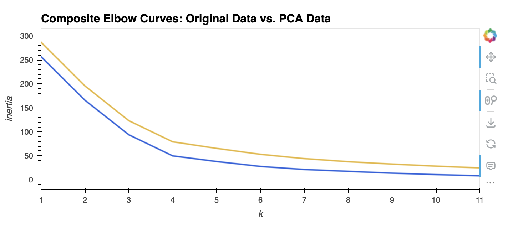

# CryptoClustering
Module 19 Challenge for UM Bootcamp

For this challenge, I used Python and unsupervised learning to predict if cryptocurrencies are affected by 24-hour or 7-day price changes.

## Prepare and Compare the Data
- A DataFrame was created with the scaled data.
- The elbow method was used to find the best value for k.
- A cluster was created for the cryptocurrencies with the best value of k on the original scaled data.
- A Principal Component Analysis (PCA) was peformed to reduce the features to three principal components.
- A DataFrame was created using the PCA data.
- The elbow method was used on the PCA data to find the best value for k.
- A cluster was created for the cryptocurrencies using the PCA data.
- The PCA data was used to reduce the features to three principals and to find the best value for k.
- Clusters were made by making a composite of the elbow line charts and the scatter plots.

The analysis shows that by removing features and creating the clusters, it is easier to identify general patterns and groupings within the data.

## Credits
I used picular to get color attributes to change the colors on the elbow line charts: https://picular.co/cryptocurrency

Thank you to tutor, Limei Hou, who helped me with figuring out how to create the composite plots and reviewing the code I started.

Thank you to Hunter Hollis, instructor, and TA's Randy and Sam.